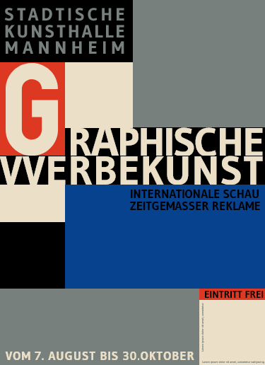

# Daily Layout No.01
*Web adaptation of a 20th century poster by Jan Tschichold*

[Click here to see the page](https://tricktrap.mx/labs/daily-layout-01/)

This is the first entry of a new project called Daily Layout, where I try to recreate magazine and print layouts in order to squeeze the hell out of CSS and it's limitations.

In this particular example I was able to experiment with:

+ CSS Grid, minmax, fraction units and that crazy layout
+ Clamp\(\) property for font sizes
+ Writing mode property and the way browsers render it

### Here is a copy of the original version I use for reference:

### The web version, flexible and responsive:

I tried to avoid media queries as much as I could, you can see the ones I use make little adjustments to a couple of texts and grid elements.

**Feel free to play around with it**

Don't forget to checkout my other repositories for more examples.

### Thank you!
